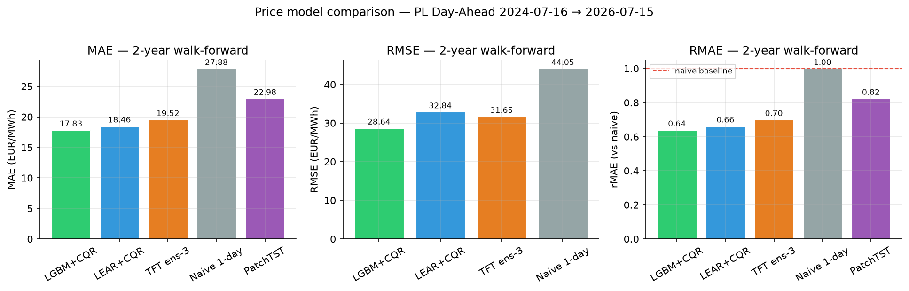

# Polish Power Market Forecasting — Load & Price, Day-Ahead

A production-style forecasting desk for the Polish power market, built
and operated by one person. Every morning it forecasts tomorrow's hourly
**load** and **day-ahead price**, scores yesterday's forecasts against
reality, explains its predictions in plain words, and commits the report.
The git history is the live track record.

**Headline results (2-year walk-forward, leakage-proof):**

- **Load: beats the Polish TSO — in backtest.** Ridge combiner 2.08%
  MAPE vs PSE's own day-ahead forecast at 2.23%, 2-year walk-forward.
  What ships daily is still the seasonal-naive incumbent: the ridge
  challenger runs in shadow until it passes the pre-agreed promotion
  gate. That is the point — promotion is earned live, not claimed from
  a backtest.
- **Price: a four-model ensemble is the new best.** CRPS-weighted blend
  of LightGBM + LEAR + a zero-shot foundation model + an archived TFT as
  diversity donor: MAE 16.88 EUR/MWh, 40% better than seasonal naive
  (DM p=2.6e-09 vs the 3-member blend, one-window artifact). LightGBM
  vs the LEAR standard: we said "matches, not beats" while the edge was
  not significant (p=0.056); the corrected 2-yr rerun now clears the
  bar (p=1.9e-03) — both artifacts kept.
- **Calibrated uncertainty.** P10/P90 bands conformally calibrated to
  ~80% empirical coverage — including the blend (double-conformal).
- **Forecasts priced in EUR.** A battery-arbitrage backtest converts
  MAE into money: the 4-member ensemble captures 92.8% of
  perfect-foresight value. Full writeup: `docs/BENCHMARK.md`.

## The two products

### 1. Day-ahead load (Phase 1 — complete)

Hourly load for the PL bidding zone, decided at 09:00 D-1, P10/P50/P90.

2-year walk-forward, 17,450 test hours
(`reports/backtests/2026-07-16_2yr_summary.csv`):

| Model | MAPE | MAE (MW) | Skill vs naive |
|---|---|---|---|
| **Ridge + TSO forecast (combiner)** | **2.08%** | **374** | **0.63** |
| LightGBM + TSO forecast | 2.12% | 384 | 0.62 |
| PSE (TSO) day-ahead forecast | 2.23% | 401 | 0.60 |
| Ridge (no TSO) | 4.05% | 710 | 0.29 |
| Seasonal naive (same hour last week) | 5.59% | 1005 | 0.00 |

Deep challengers, evaluated on the 12-month campaign
(`2026-07-15_overnight_readout.md`, `2026-07-14_fcst_summary.csv`,
model cards): LSTM-attention+TSO 2.43%, best plain LSTM of 7
architectures 3.67%, LightGBM-no-TSO 3.16%. None earned a place above
the linear combiner, so none were re-run on 2 years.

Honest findings the table forces:
- The TSO forecast is public at bid time; combining with it beats the
  TSO by ~7% MAE. Once that signal is in, **ridge beats every deep net
  we built** — and we built seven.
- Bigger nets lose. Accuracy peaked at ~106k parameters on 2y of data.
- Cheap screening splits flattered the nets by 0.6–0.9 pp vs honest
  walk-forward. Most tutorials never mention this.

### 2. Day-ahead price (Phase 2 — live since 2026-07)

PL day-ahead auction price (SDAC), EUR/MWh, forecast before gate closure.

2-year walk-forward (master tables + per-run artifacts:
`docs/BENCHMARK.md`, `reports/backtests/`):

| Model | MAE (EUR/MWh) | rMAE | Band coverage (nominal 80%) | P&L capture |
|---|---|---|---|---|
| **Ensemble (4-member, + TFT donor)** | **16.9** | **0.604** | **80.0%** | **0.928** |
| Ensemble (3-member variant, CRPS + CQR) | 17.3 | 0.621 | 79.9% | 0.926 |
| LightGBM quantile + conformal | 17.8 | 0.640 | 78.5% | 0.915 |
| LEAR + conformal (published daily) | 18.5 | 0.662 | 79.5% | 0.912 |
| TFT-730 (3-seed ensemble) | 19.5 | 0.699 | 80.9% raw | — |
| Chronos-Bolt zero-shot + CQR | 21.8 | 0.783 | 79.9% | 0.891 |
| PatchTST-730 (3-seed, trained) | 22.3 | 0.797 | 77.1% raw | — |
| TimesFM 2.5 zero-shot | 22.4 | 0.803 | 80.9% raw | 0.881 |
| Naive (same hour yesterday) | 27.9 | 1.000 | 53.1% | 0.814 |

P&L capture = share of perfect-foresight battery-arbitrage profit
(1 MW / 2 MWh battery scheduled on each model's P50). Master tables,
findings, and honest negatives: `docs/BENCHMARK.md`.



- LEAR = the industry-standard LASSO price baseline (Ziel & Weron
  2018). Ours is a simplified variant: 24 per-hour models, full D-1
  price vector, variance-stabilized target — but fewer lagged
  day-vectors than the canonical 96-regressor set, and CV-selected
  penalty instead of AIC. Deviations listed in the model card; making
  it fully faithful is on the roadmap.
- The **solar forecast is price driver #1** — top SHAP attribution AND
  largest retrain-ablation cost (+3.5 EUR/MWh MAE when dropped). Two
  independent methods, same answer: the merit order, measured.
- Spikes are the open front: all models run ~3x pooled MAE on the top-5%
  priciest hours. Documented, not hidden. Three unconditional band fixes
  failed honestly; the shipped answer is a conditional spike classifier
  (AUC 0.967) that flags risky hours in the daily report.
- **Foundation models, measured.** Chronos-Bolt zero-shot beats our
  trained PatchTST with zero training — and still joins the product
  only as an ensemble member. Moirai's covariate mode is significantly
  WORSE than its own univariate mode: covariate skill needs training.
- **Attention models: tested hard, archived honestly.** A full campaign
  (HPO, ablations, window/capacity/seed sweeps) decomposed the deep-model
  gap: nearly half was our evaluation setup (short training windows,
  single seeds), the rest is architectural. Best deep result: TFT with
  730-day windows + 3-seed ensemble, MAE 18.31 vs champion 17.66 on the
  same 1-year window. Full story: `docs/RESULTS.md` and
  `docs/model_cards/tft_price.md`.

## The daily loop (the actual product)

GitHub Actions cron, 05:30 UTC, unattended:

1. Fetch latest actuals (load, price, weather, wind/solar forecasts).
2. Score yesterday's forecasts against reality; redraw yesterday's
   charts with the realized line ("living figures").
3. Forecast tomorrow: load (incumbent + shadow challenger) and price
   (LEAR + conformal band).
4. Write a report a manager reads in 60 seconds: `reports/daily/`.
5. Commit. The history is the proof of consistent operation.

Model changes go through a promotion gate: challengers run in shadow
for 14 days and replace the incumbent only if they win on metrics agreed
in advance. Every non-obvious choice is logged in `docs/DECISIONS.md`.

## Why this is credible

- **Leakage paranoia.** The 09:00 D-1 cutoff is enforced by asserts and
  corruption-proof tests. The DST leakage test caught a real bug: on the
  25-hour October day, "minus 24 hours" reaches into the target day.
- **Baselines first.** Nothing ships without beating seasonal naive and
  the external benchmark. Losing models stay in the tables.
- **Walk-forward only.** Every reported number is out-of-sample,
  day-ahead, weekly refits, 2 years of test data (~17.5k hours; exact
  count per run in each artifact).
- **Desk-style review pack.** Drift, cumulative edge, hourly error
  profile, quantile calibration, worst-day post-mortems, monthly bias:
  `reports/figures/backtests/` (with a how-to-read README).
- **Four bugs found by our own defenses**, each documented with the
  measured impact: DST leakage, asinh blowup, solar-growth extrapolation
  (38,000 EUR/MWh predictions → z-clip guard), gap-permanence.
- **Model-risk discipline: we audited ourselves, adversarially.** An
  LLM-based audit (three passes: trace every headline number to its
  artifact, red-team the code for leakage, then a refuter pass that
  had to fail to kill each finding) confirmed 31 findings — mostly
  documentation drift after regenerated runs, plus 2 real code bugs
  against the stated cutoff, both fixed with regression tests. One
  (the training-mask cutoff) was later scope-narrowed: it applies to
  the live-observed load target, not the day-ahead-published price —
  price tables stand as-is; load tables carry a small shared caveat
  until rerun. No modeling conclusion was overturned. Full review and
  amendment: `docs/VALIDATION.md`.

## Stack

Python · LightGBM · PyTorch · LEAR (LASSO-AR) · scikit-learn · SHAP ·
DuckDB · GitHub Actions · ENTSO-E API · Open-Meteo

## Live status

| Thing | Status |
|---|---|
| Cron (05:30 UTC) | LIVE on the public repo since 2026-07-23, committing daily reports |
| Published load forecast | **seasonal naive (incumbent)** — ridge champion runs in shadow until it passes the 14-day promotion gate; challenger fetch outage under repair |
| Published price forecast | LEAR + conformal band, daily |
| Shadow runs (load + price) | running; the 07-19→21 outage hole stays in the tallies |
| 4-member ensemble (+ TFT) | new best price forecast in backtest; promotion pending owner (TFT inference cost) |
| Adversarial audit | done 2026-07-27; 31 findings remediated; cutoff finding scope-narrowed to load same day (docs/VALIDATION.md) |
| Corrected-protocol re-runs | price: rerun under the target-aware cutoff (artifacts in reports/backtests/); load: pending |
| Data store | wiped by a git accident 2026-07-24, fully rebuilt same day from APIs; all numbers reproduced (DECISIONS) |

Updated 2026-07-27. Outages and accidents are part of ops reality;
the tallies and DECISIONS.md record them instead of hiding them.

## Quickstart

```bash
curl -LsSf https://astral.sh/uv/install.sh | sh  # install uv (skip if you have it)
make setup            # install deps, exact locked versions
cp .env.example .env  # add your ENTSO-E token (free)
make test             # unit tests, no network
make dry-run          # one full daily cycle: fetch, score, forecast, report
```

Backtests: `uv run python -m src.evaluation.run_backtest` (load),
`uv run python -m src.evaluation.run_price_backtest` (price).
SQL analysis of all datasets: `notebooks/01_sql_analysis.ipynb` (DuckDB).

## Map

- `docs/RESULTS.md` — every headline number, one page, canonical
- `docs/HOW_A_FORECAST_IS_MADE.md` — the daily run, step by step
- `docs/PLAN.md` — roadmap and current phase
- `docs/DECISIONS.md` — every non-obvious call, three lines each
- `docs/model_cards/` — one honest card per model
- `docs/notes/learning/` — the concepts, one page each (LaTeX)
- `docs/notes/model_selection/` — which model when, honest verdicts (LaTeX)
- `reports/daily/` — the live track record
- `reports/backtests/` — every results table cited above
