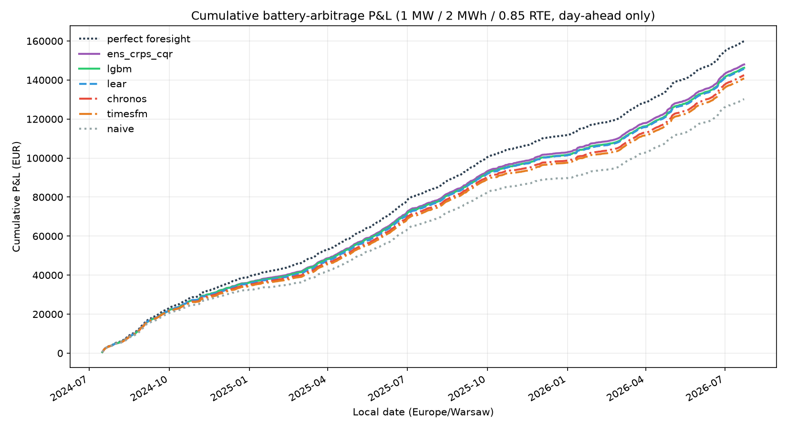

# Battery-arbitrage P&L — 2026-07-24_pnl

Battery: 1 MW / 2 MWh / 0.85 round-trip / 1 cycle per day.
Schedule from each model's P50 at D-1, settled at actual DA
prices. Day-ahead market only. Same days for every model.
Capture rate = total P&L / perfect-foresight P&L.

|              |   eur_per_day |   total_eur |   capture_rate |   loss_days_pct |   n_days |
|:-------------|--------------:|------------:|---------------:|----------------:|---------:|
| perfect      |       221.404 |      159854 |          1     |           0     |      722 |
| ens_crps_cqr |       204.944 |      147970 |          0.926 |           1.801 |      722 |
| lgbm         |       202.591 |      146271 |          0.915 |           2.078 |      722 |
| lear         |       201.714 |      145637 |          0.911 |           1.385 |      722 |
| chronos      |       197.245 |      142411 |          0.891 |           2.632 |      722 |
| timesfm      |       194.953 |      140756 |          0.881 |           2.632 |      722 |
| naive        |       180.241 |      130134 |          0.814 |           4.432 |      722 |

