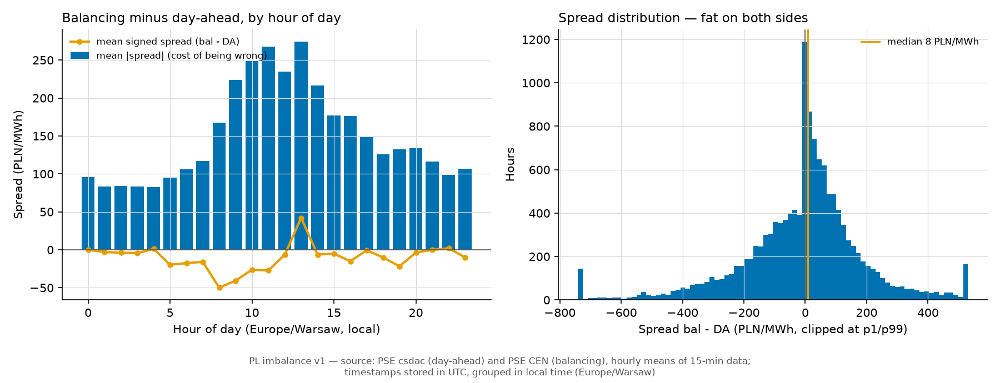

# Imbalance market v1 — 2026-07-28

First look at the third link of the chain: day-ahead, intraday, **imbalance**. The imbalance price is what the grid operator (PSE) charges for the MWh you did not cover in the markets. We fetch that price but have never used it. This is the v1 read.

Period: **2024-06-13 to 2026-07-22**, **18,456 hours**. Prices in PLN/MWh.

## 1. What the spread is

Spread = balancing price minus day-ahead price. Positive means closing your position late is expensive.

- Mean spread: **-16 PLN/MWh** — near zero, so there is no free money in one direction.
- Median spread: **4 PLN/MWh**.
- But the average *size* of the gap is **151 PLN/MWh**. That is the number that hurts.
- Balancing beats day-ahead in **51%** of hours — a coin flip.
- Tails: p5 = -362, p95 = 288 PLN/MWh. Standard deviation 313.

Plain words: the spread is a **volatility problem, not a bias problem**. On average it nets out. Hour by hour it is huge.

## 2. When it bites

Worst hour: **13:00 local**, mean gap 260 PLN/MWh. The midday solar hours are the expensive ones. Night hours are roughly half as bad.

|   hour_local |   n_hours |   mean_pln |   median_pln |   mean_abs_pln |   share_bal_above_da |
|-------------:|----------:|-----------:|-------------:|---------------:|---------------------:|
|            0 |       769 |      -16.4 |          0   |          103   |                  0.5 |
|            1 |       769 |      -13.7 |          6.4 |           95.5 |                  0.5 |
|            2 |       769 |      -15.4 |          5.8 |           99.1 |                  0.5 |
|            3 |       769 |      -14.6 |          7.9 |           97.2 |                  0.6 |
|            4 |       769 |       -8.7 |          9.8 |           92.8 |                  0.6 |
|            5 |       769 |      -26.5 |          0   |          100.8 |                  0.5 |
|            6 |       769 |      -21.2 |          6   |          106.9 |                  0.5 |
|            7 |       769 |       -9.5 |          6.8 |          119.7 |                  0.5 |
|            8 |       769 |      -34.8 |          0   |          160.6 |                  0.5 |
|            9 |       769 |      -34   |          1.6 |          206.2 |                  0.5 |
|           10 |       769 |      -34.3 |          0   |          236.3 |                  0.5 |
|           11 |       769 |      -34.4 |          0   |          258.9 |                  0.5 |
|           12 |       769 |      -20.9 |          0   |          240.1 |                  0.5 |
|           13 |       769 |       17.5 |          0   |          260.2 |                  0.5 |
|           14 |       769 |      -18.4 |          0   |          210.7 |                  0.5 |
|           15 |       769 |      -11.3 |         13.3 |          177   |                  0.5 |
|           16 |       769 |      -19.1 |          8.8 |          169.4 |                  0.5 |
|           17 |       769 |       -6.7 |          2.6 |          148.6 |                  0.5 |
|           18 |       769 |      -15   |          0   |          134.8 |                  0.5 |
|           19 |       769 |      -19.5 |          1   |          136.2 |                  0.5 |
|           20 |       769 |       -3.2 |          2.1 |          134.8 |                  0.5 |
|           21 |       769 |       -4.8 |          3.9 |          118.7 |                  0.5 |
|           22 |       769 |       -8.8 |          9.8 |          106.2 |                  0.6 |
|           23 |       769 |      -16.4 |          4.7 |          110.2 |                  0.5 |

By year:

|   year_local |   n_hours |   mean_pln |   median_pln |   mean_abs_pln |   share_bal_above_da |
|-------------:|----------:|-----------:|-------------:|---------------:|---------------------:|
|         2024 |      4825 |      -33.6 |         -2.5 |          154.4 |                  0.5 |
|         2025 |      8760 |       -4.5 |          8   |          147   |                  0.5 |
|         2026 |      4871 |      -20.1 |          7.4 |          154.9 |                  0.5 |

## 3. What a 1 MWh miss costs

Assumption in one line: a party sizes its day-ahead buy on our P50 price forecast; whatever it got wrong is settled at the balancing price. Under-forecast means buy the rest late (cost = spread), over-forecast means sell the surplus back (cost = minus spread). This prices risk. It is not a dispatch simulation.

| model | hours | our MAE (PLN/MWh) | naive cost bound (PLN/MWh) | mean cost of a 1 MWh miss | costly hours | mean cost when under | mean cost when over |
|---|---|---|---|---|---|---|---|
| ens_crps_cqr_tft | 17,456 | 72 | 149 | -8.1 | 50% | -20.2 | 6.2 |
| lgbm_quantile_conformal | 17,672 | 76 | 150 | -8.7 | 50% | -21.0 | 5.4 |

How to read the row: *naive cost bound* is the average absolute spread — what you pay if every miss lands on the wrong side. *Mean cost* is what our actual misses cost, sign included.

- Our day-ahead price error is **76 PLN/MWh** (MAE, converted from EUR).
- The imbalance spread we would face is **150 PLN/MWh** on average — about 2.0x our price error.
- Actual mean cost of a miss: **-8.7 PLN/MWh** — a small net gain versus zero, with **50%** of misses landing on the losing side.
- Spread of that cost: 317 PLN/MWh. t-statistic of the mean, clustered by day: -2.5. Correlation between our price error and the spread: 0.04.

## 4. Takeaway

**The imbalance spread is about 2x bigger than our whole day-ahead price error, and our forecast carries almost no information about it (correlation 0.04, 50% of misses lose money). So an imbalance model is worth scoping — but it must predict the *sign* of the spread. A better day-ahead price model will not move this number.**

Our misses are on average slightly lucky (-8.7 PLN/MWh, day-clustered t = -2.5 — too weak to trade on). Do not build a strategy on it yet.

### Caveats

- EUR errors were converted to PLN with the hourly implied rate `price_da_pln / price_da_eur`. Hours with a EUR price below 5 EUR/MWh (including negative-price hours) get their local day's median rate instead — the raw ratio explodes near zero.
- The balancing price is a single settlement price here. Real PSE settlement has more components.
- One MWh per hour, treated independently. No volume model, no intraday leg, no portfolio netting.