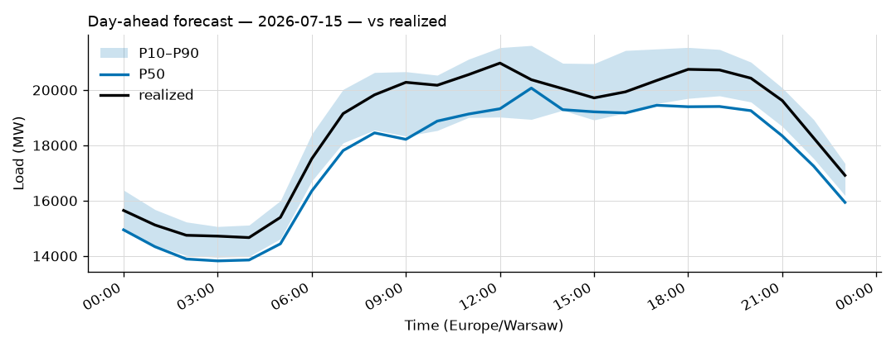

# Daily forecast report — 2026-07-14

Model: seasonal naive (same hour, last 7 days; quantiles from last 4 weeks).

## Yesterday (2026-07-13) — how did we do?

| Forecast | MAPE |
|---|---|
| Ours (naive) | 4.93% |
| TSO day-ahead | 1.99% |

## Tomorrow (2026-07-15) — the forecast

- Expected peak: **20,069 MW** around 13:00 local time.
- Daily range (P50): 13,824 – 20,069 MW.
- Uncertainty band at peak: 18,938 – 21,609 MW (P10–P90).

### Top drivers (plain words)

1. Same hour last week. The naive model copies it.
2. Day of week: tomorrow is a Wednesday.
3. Warsaw temperature tomorrow: 18 to 28 °C (not yet used by the model).

### Oddities

- None.

_Full hourly quantiles: see `data/forecasts/`._
