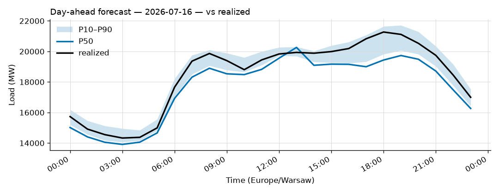

# Daily forecast report — 2026-07-15

Model: seasonal naive — **BASELINE**, not the final model. P50 copies the same hour 7 days ago; the band is the spread of the last 4 weeks. Serves until a trained model earns promotion (see docs/PLAN.md M4, UAT rules M9).

## Yesterday (2026-07-14) — how did we do?

| Forecast | MAPE |
|---|---|
| Ours (naive, incumbent) | 3.98% |
| Challenger (ridge+TSO, shadow) | n/a |
| TSO day-ahead | 2.12% |

## Tomorrow (2026-07-16) — the forecast

- Expected peak: **20,264 MW** around 13:00 local time.
- Daily range (P50): 13,911 – 20,264 MW.
- Uncertainty band at peak: 19,687 – 20,303 MW (P10–P90).

### Top drivers (plain words)

1. Same hour last week. The naive model copies it.
2. Day of week: tomorrow is a Thursday.
3. Warsaw temperature tomorrow: 19 to 29 °C (not yet used by the model).

### Oddities

- Challenger failed: No data in data/raw/weather_forecast. Run: make backfill

_Full hourly quantiles: see `data/forecasts/`._
