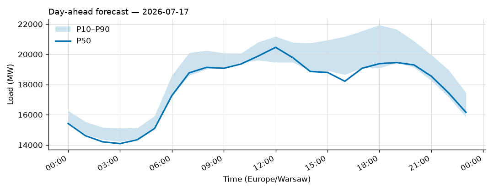
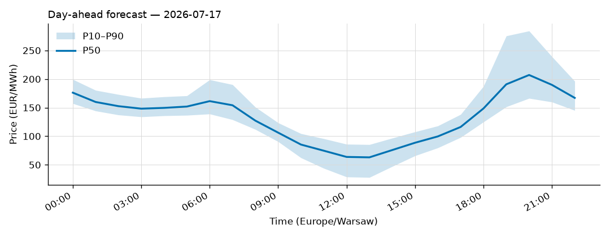

# Daily forecast report — 2026-07-16

Model: seasonal naive — **BASELINE**, not the final model. P50 copies the same hour 7 days ago; the band is the spread of the last 4 weeks. Serves until a trained model earns promotion (see docs/PLAN.md M4, UAT rules M9).

## Yesterday (2026-07-15) — how did we do?

| Forecast | MAPE |
|---|---|
| Ours (naive, incumbent) | 5.74% |
| Challenger (ridge+TSO, shadow) | n/a |
| TSO day-ahead | 1.15% |

## Tomorrow (2026-07-17) — the forecast

- Expected peak: **20,460 MW** around 12:00 local time.
- Daily range (P50): 14,091 – 20,460 MW.
- Uncertainty band at peak: 19,471 – 21,177 MW (P10–P90).

### Top drivers (plain words)

1. Same hour last week. The naive model copies it.
2. Day of week: tomorrow is a Friday.
3. Warsaw temperature tomorrow: 22 to 32 °C (not yet used by the model).

### Oddities

- Challenger shadow started today; first score tomorrow.
- Price: no saved forecast for yesterday; first score tomorrow.
- Price: RES forecast for 2026-07-17 not yet published (24 h persisted from the day before).

## Price — day-ahead (LEAR, shadow)

### Yesterday (2026-07-15) — forecast vs realized

| Model | MAE (EUR/MWh) |
|---|---|
| LEAR | nan |
| naive-1d | nan |

### Tomorrow (2026-07-17) — the price forecast

- Expected peak price: **207 EUR/MWh** around 20:00 local.
- P50 range: 63 – 207 EUR/MWh; band at peak 166 – 284.

_Full hourly quantiles: see `data/forecasts/`._
