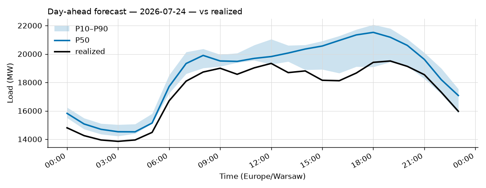
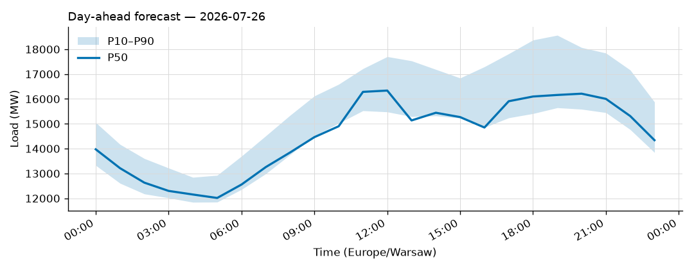
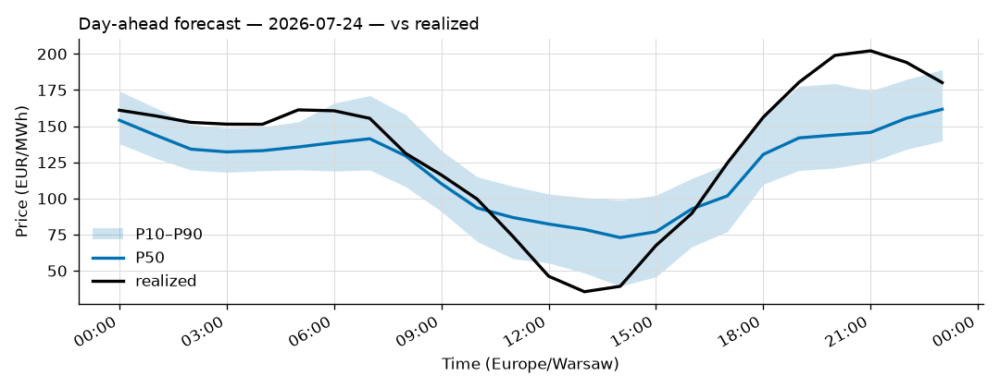
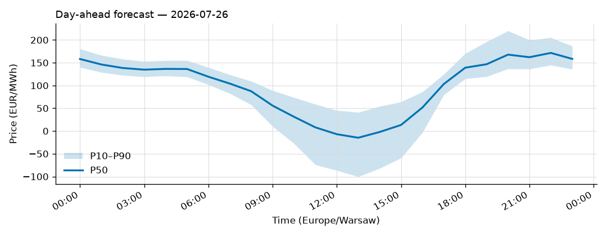

# Daily forecast report — 2026-07-25

Model: seasonal naive — **BASELINE**, not the final model. P50 copies the same hour 7 days ago; the band is the spread of the last 4 weeks. Serves until a trained model earns promotion (see docs/PLAN.md M4, UAT rules M9).

## Yesterday (2026-07-24) — how did we do?

| Forecast | MAPE |
|---|---|
| Ours (naive, incumbent) | 7.01% |
| Challenger (ridge+TSO, shadow) | 4.25% |
| TSO day-ahead | 6.04% |

## Tomorrow (2026-07-26) — the forecast

- Expected peak: **16,338 MW** around 12:00 local time.
- Daily range (P50): 12,015 – 16,338 MW.
- Uncertainty band at peak: 15,479 – 17,704 MW (P10–P90).

### Top drivers (plain words)

1. Same hour last week. The naive model copies it.
2. Day of week: tomorrow is a Sunday.
3. Warsaw temperature tomorrow: 16 to 30 °C (not yet used by the model).

### Oddities

- Price: RES forecast for 2026-07-26 not yet published (24 h persisted from the day before).

## Price — day-ahead (LEAR, shadow)

### Yesterday (2026-07-24) — forecast vs realized

| Model | MAE (EUR/MWh) |
|---|---|
| LEAR (incumbent) | 22.75 |
| LightGBM+conformal (shadow) | 25.16 |
| naive-1d | 25.75 |

### Tomorrow (2026-07-26) — the price forecast

- Expected peak price: **172 EUR/MWh** around 22:00 local.
- P50 range: -15 – 172 EUR/MWh; band at peak 145 – 205.
- Spike risk low. Highest flag score 0% at 20:00 local.

_Full hourly quantiles: see `data/forecasts/`._
