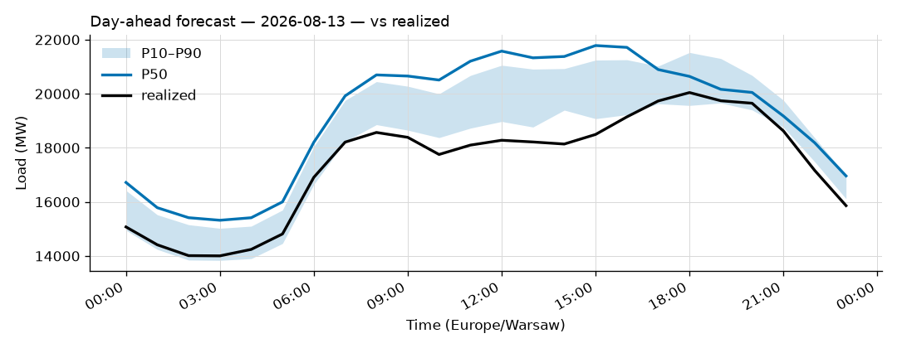
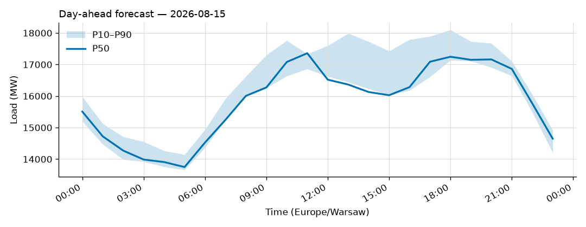
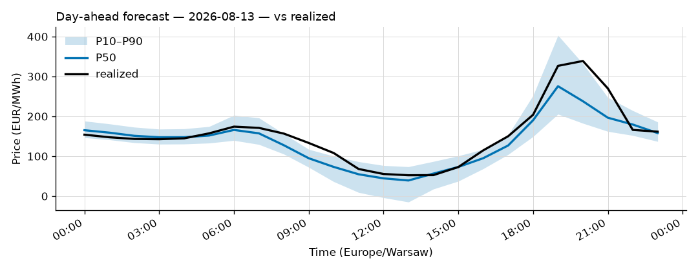
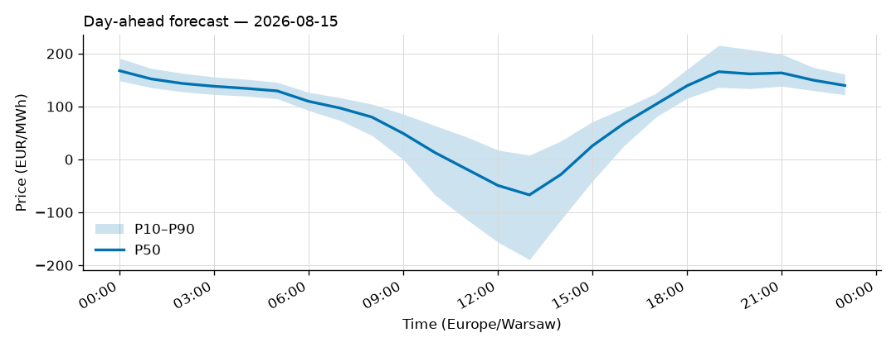

# Daily forecast report — 2026-08-14

Model: seasonal naive — **BASELINE**, not the final model. P50 copies the same hour 7 days ago; the band is the spread of the last 4 weeks. Serves until a trained model earns promotion (see docs/PLAN.md M4, UAT rules M9).

## Yesterday (2026-08-13) — how did we do?

| Forecast | MAPE |
|---|---|
| Ours (naive, incumbent) | 10.11% |
| Challenger (ridge+TSO, shadow) | n/a |
| TSO day-ahead | 2.25% |

## Tomorrow (2026-08-15) — the forecast

- Expected peak: **17,358 MW** around 11:00 local time.
- Daily range (P50): 13,749 – 17,358 MW.
- Uncertainty band at peak: 16,865 – 17,337 MW (P10–P90).

### Top drivers (plain words)

1. Same hour last week. The naive model copies it.
2. Day of week: tomorrow is a Saturday.
3. Warsaw temperature tomorrow: 16 to 30 °C (not yet used by the model).

### Oddities

- Challenger shadow started today; first score tomorrow.
- Price: RES forecast for 2026-08-15 not yet published (24 h persisted from the day before).

## Price — day-ahead (LEAR, shadow)

### Yesterday (2026-08-13) — forecast vs realized

| Model | MAE (EUR/MWh) |
|---|---|
| LEAR (incumbent) | 21.18 |
| LightGBM+conformal (shadow) | 15.09 |
| naive-1d | 14.00 |

### Tomorrow (2026-08-15) — the price forecast

- Expected peak price: **167 EUR/MWh** around 00:00 local.
- P50 range: -67 – 167 EUR/MWh; band at peak 149 – 191.

_Full hourly quantiles: see `data/forecasts/`._
