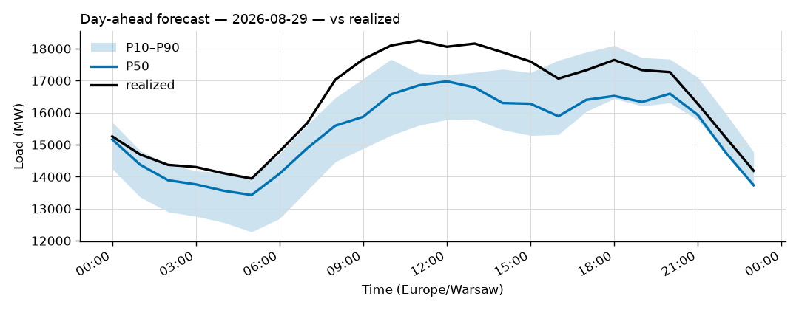
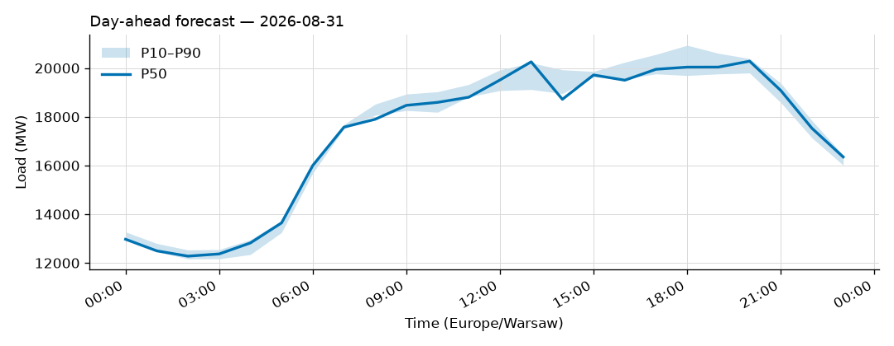

# Daily forecast report — 2026-08-30

Model: seasonal naive — **BASELINE**, not the final model. P50 copies the same hour 7 days ago; the band is the spread of the last 4 weeks. Serves until a trained model earns promotion (see docs/PLAN.md M4, UAT rules M9).

## Yesterday (2026-08-29) — how did we do?

| Forecast | MAPE |
|---|---|
| Ours (naive, incumbent) | 5.35% |
| Challenger (ridge+TSO, shadow) | n/a |
| TSO day-ahead | 1.51% |

## Tomorrow (2026-08-31) — the forecast

- Expected peak: **20,285 MW** around 20:00 local time.
- Daily range (P50): 12,279 – 20,285 MW.
- Uncertainty band at peak: 19,799 – 20,392 MW (P10–P90).

### Top drivers (plain words)

1. Same hour last week. The naive model copies it.
2. Day of week: tomorrow is a Monday.
3. Warsaw temperature tomorrow: 19 to 27 °C (not yet used by the model).

### Oddities

- Challenger failed: HTTPSConnectionPool(host='api.open-meteo.com', port=443): Read timed out. (read timeout=30)
- Price step failed: 503 Server Error: Service Unavailable for url: https://web-api.tp.entsoe.eu/api?documentType=A44&in_Domain=10YPL-AREA-----S&out_Domain=10YPL-AREA-----S&offset=0&contract_MarketAgreement.type=A01&securityToken=REDACTED&periodStart=202608292200&periodEnd=202609012200

_Full hourly quantiles: see `data/forecasts/`._
