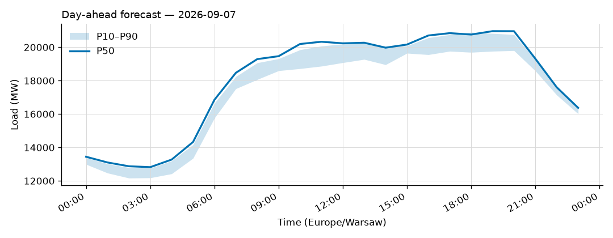
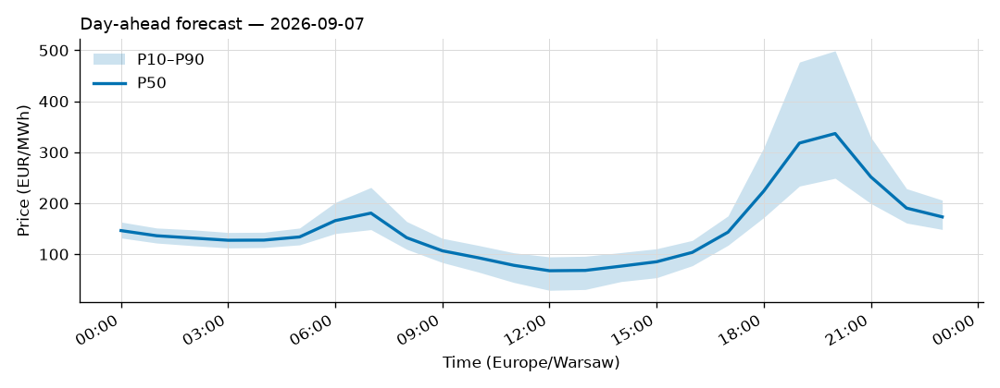

# Daily forecast report — 2026-09-06

Model: seasonal naive — **BASELINE**, not the final model. P50 copies the same hour 7 days ago; the band is the spread of the last 4 weeks. Serves until a trained model earns promotion (see docs/PLAN.md M4, UAT rules M9).

## Yesterday (2026-09-05) — how did we do?

| Forecast | MAPE |
|---|---|
| Ours (naive, incumbent) | 1.56% |
| Challenger (ridge+TSO, shadow) | n/a |
| TSO day-ahead | 2.04% |

## Tomorrow (2026-09-07) — the forecast

- Expected peak: **20,964 MW** around 19:00 local time.
- Daily range (P50): 12,821 – 20,964 MW.
- Uncertainty band at peak: 19,761 – 20,826 MW (P10–P90).

### Top drivers (plain words)

1. Same hour last week. The naive model copies it.
2. Day of week: tomorrow is a Monday.
3. Warsaw temperature tomorrow: 12 to 20 °C (not yet used by the model).

### Oddities

- Challenger failed: HTTPSConnectionPool(host='api.open-meteo.com', port=443): Read timed out. (read timeout=30)
- Price: RES forecast for 2026-09-07 not yet published (24 h persisted from the day before).

## Price — day-ahead (LEAR, shadow)

### Yesterday (2026-09-05) — forecast vs realized

| Model | MAE (EUR/MWh) |
|---|---|
| LEAR (incumbent) | 47.79 |
| LightGBM+conformal (shadow) | 48.37 |
| naive-1d | 73.67 |

### Tomorrow (2026-09-07) — the price forecast

- Expected peak price: **337 EUR/MWh** around 20:00 local.
- P50 range: 68 – 337 EUR/MWh; band at peak 249 – 499.

_Full hourly quantiles: see `data/forecasts/`._
