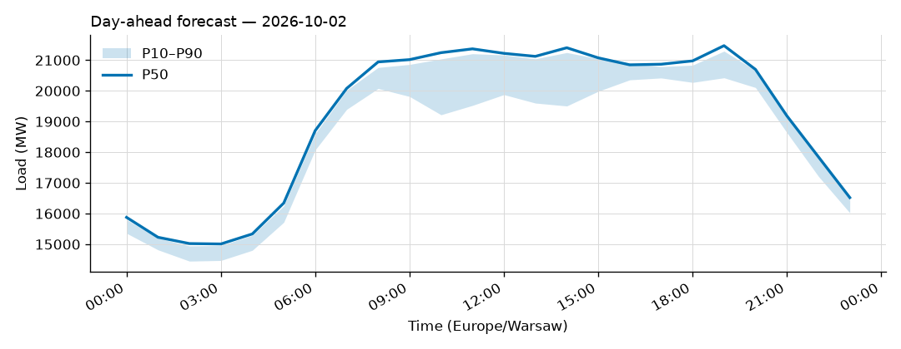
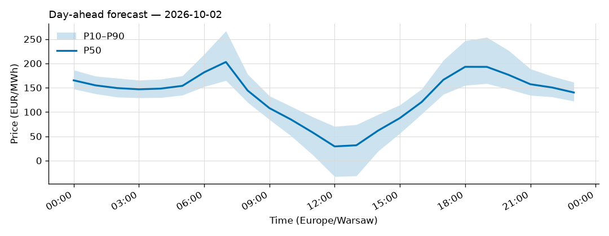

# Daily forecast report — 2026-10-01

Model: seasonal naive — **BASELINE**, not the final model. P50 copies the same hour 7 days ago; the band is the spread of the last 4 weeks. Serves until a trained model earns promotion (see docs/PLAN.md M4, UAT rules M9).

## Yesterday (2026-09-30) — how did we do?

| Forecast | MAPE |
|---|---|
| Ours (naive, incumbent) | 2.99% |
| Challenger (ridge+TSO, shadow) | n/a |
| TSO day-ahead | 2.09% |

## Tomorrow (2026-10-02) — the forecast

- Expected peak: **21,472 MW** around 19:00 local time.
- Daily range (P50): 15,009 – 21,472 MW.
- Uncertainty band at peak: 20,424 – 21,294 MW (P10–P90).

### Top drivers (plain words)

1. Same hour last week. The naive model copies it.
2. Day of week: tomorrow is a Friday.
3. Warsaw temperature tomorrow: 9 to 21 °C (not yet used by the model).

### Oddities

- Challenger failed: HTTPSConnectionPool(host='api.open-meteo.com', port=443): Read timed out. (read timeout=30)
- Price: RES forecast for 2026-10-02 not yet published (24 h persisted from the day before).

## Price — day-ahead (LEAR, shadow)

### Yesterday (2026-09-30) — forecast vs realized

| Model | MAE (EUR/MWh) |
|---|---|
| LEAR (incumbent) | 11.55 |
| LightGBM+conformal (shadow) | 13.98 |
| naive-1d | 28.95 |

### Tomorrow (2026-10-02) — the price forecast

- Expected peak price: **203 EUR/MWh** around 07:00 local.
- P50 range: 29 – 203 EUR/MWh; band at peak 165 – 267.

_Full hourly quantiles: see `data/forecasts/`._
