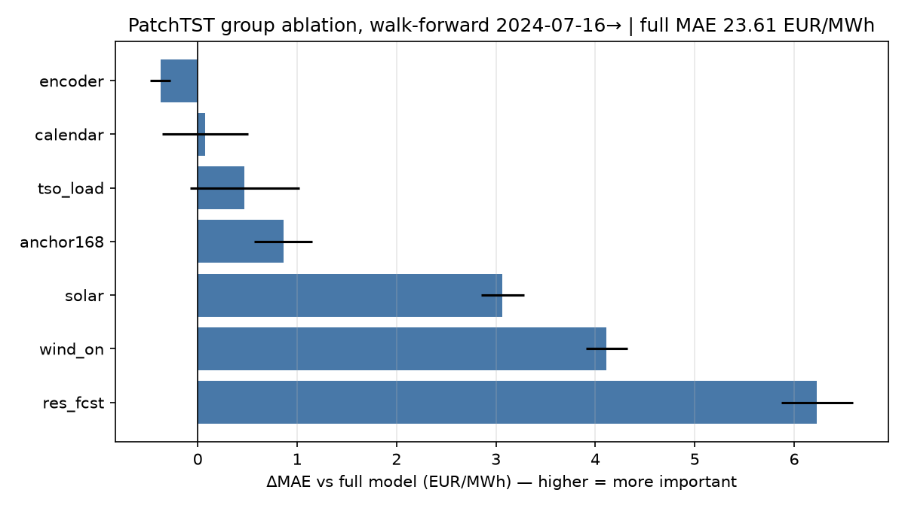
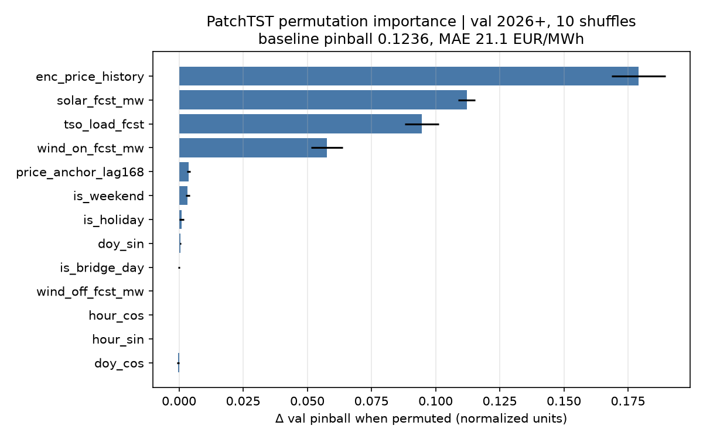
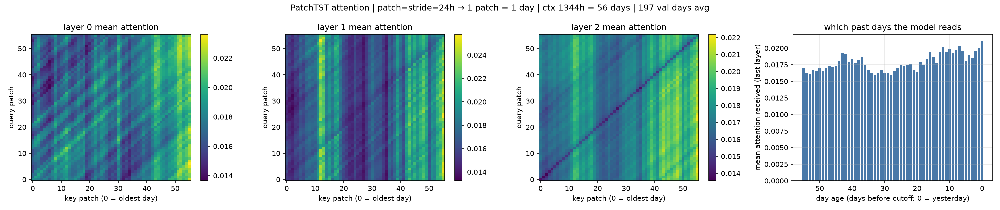
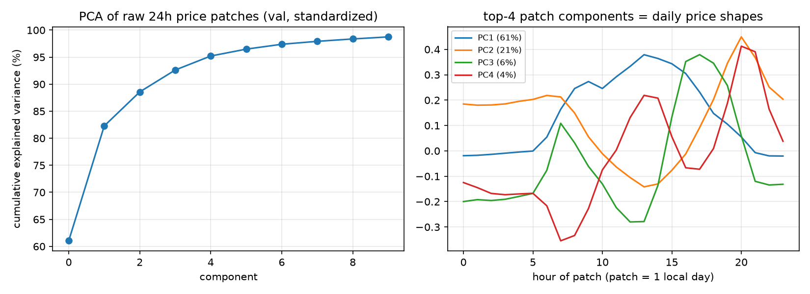
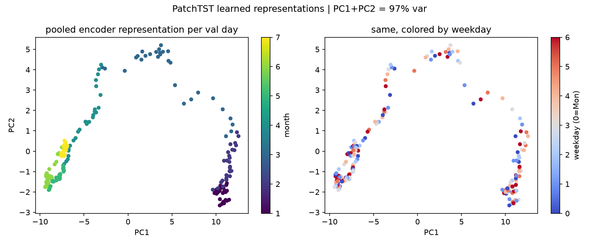

# PatchTST feature analysis — why it lost

Config: patch24_s24_ctx1344 (best of 27-config sweep), d_model=64, 197k params.
Context: PatchTST lost the 2-year walk-forward.
MAE 22.98 vs TFT 19.71 vs LGBM 17.8 EUR/MWh. Coverage 69.5% vs 80% target.
This analysis shows why.

## Headline finding

**At the 365-day training windows used in the original walk-forward, the
price-history encoder adds nothing.** Zero the entire 56-day encoder
input, retrain, and the model does not get worse (MAE 23.23 vs 23.61;
-0.38, within seed noise). All the skill lives in the known-future
covariates. The RES generation forecast dominates. The model is, in
effect, an expensive MLP over tomorrow's RES + load forecasts.

**Follow-up (730-day windows): the redundancy is a window artifact.**
With twice the training data the encoder is worth +2.5 EUR/MWh (all 3
seeds, `ablation_walkforward_w730.csv`) and the full model improves to
MAE 20.27 with coverage 67→75%. The model *can* use price history — 365
days was too little data to learn how. Both statements matter: the
original negative verdict stands for the walk-forward as run, and the
diagnosis is "training window too short", not "history is useless".
See `../tft/README.md` for the cross-model table.

## Group ablation (walk-forward, 3 seeds: 42, 7, 2026)

Zero one input group after standardization, retrain, rerun the full
2-year walk-forward (monthly refits, 17,472 test hours per run).
ΔMAE vs full = the group's non-redundant information.

| group      | MAE mean | MAE std | rMAE  | coverage 80% | ΔMAE vs full |
|:-----------|---------:|--------:|------:|-------------:|-------------:|
| encoder    |   23.231 |   0.102 | 0.832 |        73.2% |       -0.376 |
| full       |   23.607 |   0.529 | 0.845 |        68.5% |        0     |
| calendar   |   23.683 |   0.434 | 0.848 |        71.4% |       +0.076 |
| tso_load   |   24.079 |   0.549 | 0.862 |        70.7% |       +0.473 |
| anchor168  |   24.466 |   0.296 | 0.876 |        67.2% |       +0.860 |
| solar      |   26.673 |   0.217 | 0.955 |        69.0% |       +3.066 |
| wind_on    |   27.721 |   0.212 | 0.993 |        73.3% |       +4.114 |
| res_fcst   |   29.838 |   0.360 | 1.068 |        74.0% |       +6.231 |

- **res_fcst (solar + onshore + offshore wind forecast): +6.2 EUR/MWh.**
  Without it the model is worse than the naive lag-24 baseline (rMAE 1.07).
  Merit-order in action: renewables set tomorrow's price.
- **RES split: wind (+4.1) beats solar (+3.1).** Wind is the less
  predictable series, so its forecast carries more unique information —
  solar is partly recoverable from calendar + season. The individual
  deltas sum to 7.2 > joint 6.2: the two forecasts overlap (both proxy
  residual load).
- **anchor168 (+0.9) and tso_load (+0.5)**: small but real.
- **calendar (+0.1)**: redundant. Weekly rhythm already sits in the
  RES/TSO forecasts and the anchor.
- **encoder (-0.4)**: removing 56 days of price history *helps* slightly
  (and improves coverage by 4.6pp). The encoder is dead weight that adds
  overfitting surface on 365-day training windows.

## Training-window test (root-cause check)

Claim under test: "365-day windows overfit the 197k-param net."
Same walk-forward, test 2025-07-16 →, 3 seeds
(`window_walkforward.csv`):

| train window | MAE           | coverage 80% |
|:-------------|--------------:|-------------:|
| 365 d        | 21.50 ± 0.55  |        67.0% |
| 730 d        | 20.27 ± 0.23  |        74.9% |

Doubling the window: −1.2 EUR/MWh, +7.9pp coverage, seed spread halves.
Root cause confirmed. The 730d group ablation
(`ablation_walkforward_w730.csv`) shows the input ranking under the
longer window: RES +5.8 > wind +4.3 > solar +2.9 > **encoder +2.5** >
TSO +1.3 > calendar +0.4 > anchor +0.1 (anchor value migrates into the
encoder once the model can use history).

## Capacity sweep at 730d windows (`capacity730.csv`)

Last root-cause claim tested: "197k params too small." d_model
{64, 96, 128, 192} at 730d windows, 1-yr walk-forward:
d64 20.53 | d96 20.63 | **d128 19.92** | d192 20.25 (seed 42).
d128 confirmed on 3 seeds (20.46/20.87), ens-3 **19.78** vs d64 ens-3
19.94. Capacity buys ~0.2 EUR/MWh — marginal.

**Loss decomposition (1-yr test window, vs champion LGBM 17.66):**
training window +1.2 | seed-ensemble +0.3 | capacity +0.2 |
remainder ≈ 1.5 = architecture (TFT ens-3 18.31 at same window —
LSTM + variable selection, not patch attention, is what closes it).

## Permutation importance (screening split, val 2026+, 10 shuffles)

Shuffle one input across val days, keep the trained model fixed.

| feature             | Δ pinball | ΔMAE (EUR/MWh) |
|:--------------------|----------:|---------------:|
| enc_price_history   |    +0.179 |         +26.1 |
| solar_fcst_mw       |    +0.112 |         +15.2 |
| tso_load_fcst       |    +0.095 |         +13.9 |
| wind_on_fcst_mw     |    +0.058 |          +8.3 |
| price_anchor_lag168 |    +0.004 |          +0.5 |
| is_weekend          |    +0.003 |          +0.8 |
| others              |     ~0    |           ~0  |

**Permutation says the encoder matters most; ablation says it matters
not at all. Both are correct.** Permutation measures what a *fixed*
trained model relies on. Ablation with retraining measures whether the
information is *unique*. The trained model leans on price history, but
everything it extracts from it is also recoverable from the covariates —
so a model trained without the encoder loses nothing. Classic
redundancy signature.

Caveats:
- hour_sin/hour_cos are identical for every sample, so shuffling across
  samples is a no-op. Their zero score is structural, not evidence.
- wind_off_fcst_mw is zeroed by the zero-variance guard (all-zero in
  training), so its zero score is expected.

## Attention patterns

patch = stride = 24h, so one patch = one day and the attention map reads
as "which past days does the model look at".

- Top-5 attended day ages: 0 (yesterday), 7, 12, 1, 10.
- But the map is nearly flat: weights span 0.014-0.022 against a
  uniform baseline of 1/56 = 0.018. Faint recency and weekly stripes,
  nothing more.

Sensible-looking attention, near-zero marginal value — the ablation
proves the flat map is not hiding useful structure.

## PCA

- Raw 24h price patches: PC1-4 explain 93% of variance. Daily price
  shapes are low-rank (level, morning/evening ramp, midday solar dip).
- Learned pooled representation: PC1-2 explain 97%. The encoder
  compresses 56 days into what is effectively a 2-dimensional summary —
  consistent with it carrying little unique information.

## Takeaway for the model portfolio

The PatchTST negative result is now explained, not just observed:

1. On PL day-ahead price, skill comes from known-future covariates
   (RES forecast above all), not from long price history.
2. Long-context attention is architecture spent on redundant input.
3. LGBM wins because it spends its capacity directly on the covariates.

Generated by `src/models/deep/patchtst_feature_analysis.py`
(ablation CSV: `ablation_walkforward.csv`, incremental, idempotent).
