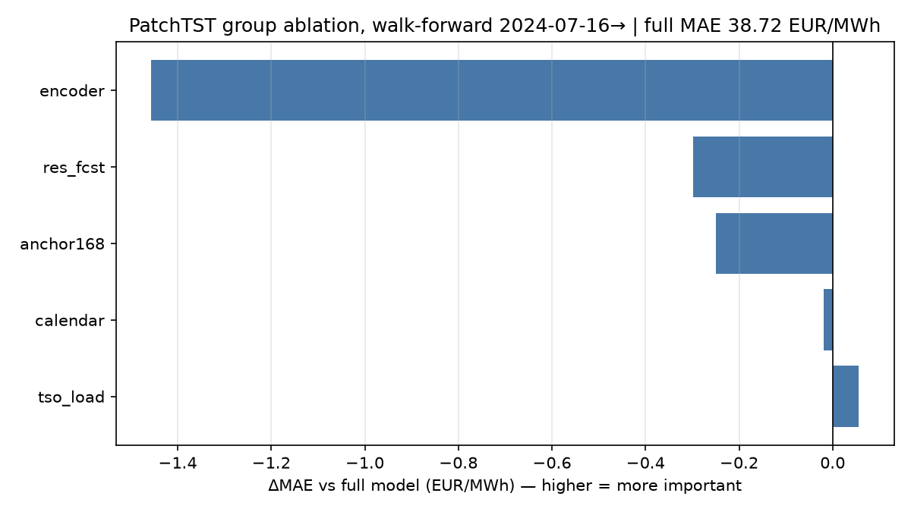
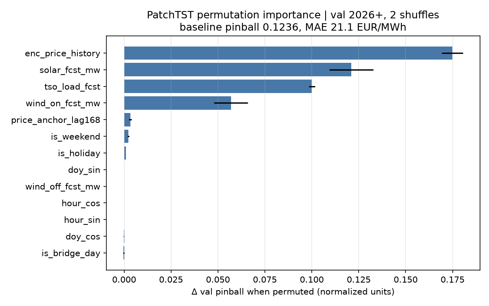
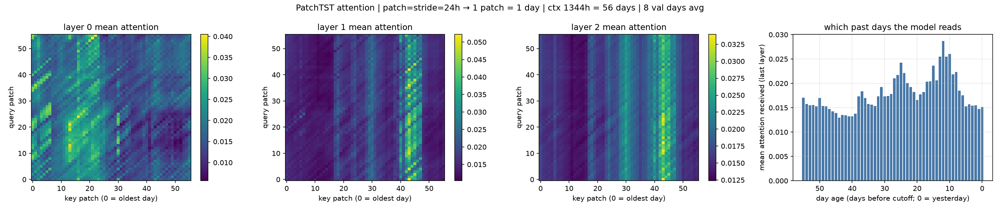
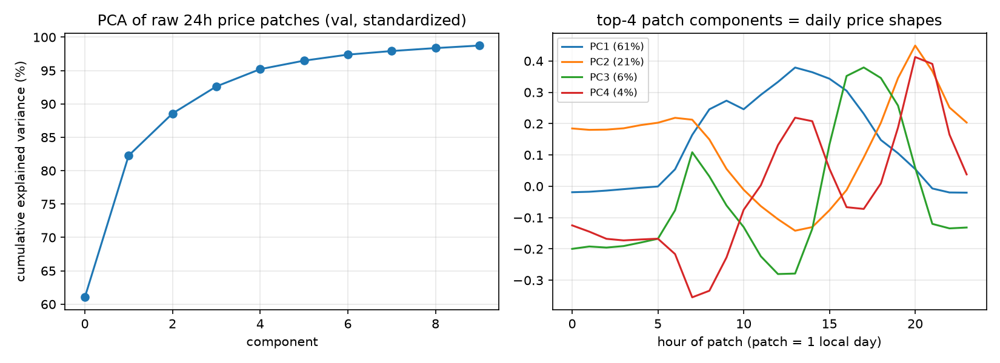
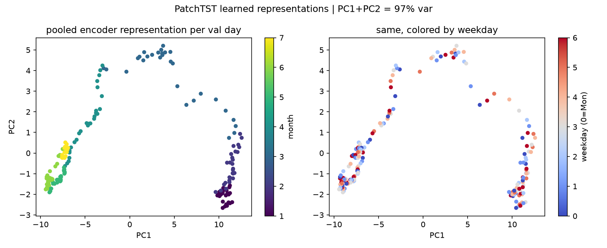

# PatchTST feature analysis

Config: patch24_s24_ctx1344, d_model=64.
Context: PatchTST lost the 2-year walk-forward (MAE 22.98 vs TFT 19.71 vs LGBM 17.8 EUR/MWh).
This analysis shows where its signal comes from.

## Group ablation (walk-forward, 3 seeds)

Zero one input group, retrain, rerun 2-year walk-forward.
ΔMAE vs full = importance of that group.

| group     |   mae_mean |   mae_std |   rmae_mean |   cov_mean |   seeds |   delta_mae |
|:----------|-----------:|----------:|------------:|-----------:|--------:|------------:|
| encoder   |     37.267 |       nan |       1.492 |     87.143 |       1 |      -1.457 |
| res_fcst  |     38.424 |       nan |       1.538 |     85.952 |       1 |      -0.299 |
| anchor168 |     38.474 |       nan |       1.54  |     85.714 |       1 |      -0.249 |
| calendar  |     38.704 |       nan |       1.549 |     85.119 |       1 |      -0.019 |
| full      |     38.723 |       nan |       1.55  |     85.595 |       1 |       0     |
| tso_load  |     38.779 |       nan |       1.552 |     85.595 |       1 |       0.055 |

## Permutation importance (screening split, val 2026+)

| feature             |   delta_pinball |   delta_pinball_std |   delta_mae_eur |   delta_mae_std |
|:--------------------|----------------:|--------------------:|----------------:|----------------:|
| enc_price_history   |          0.1749 |              0.0056 |         25.5787 |          0.7721 |
| solar_fcst_mw       |          0.1211 |              0.0117 |         16.3539 |          1.4954 |
| tso_load_fcst       |          0.1    |              0.0017 |         14.6074 |          0.2887 |
| wind_on_fcst_mw     |          0.0569 |              0.009  |          8.1488 |          0.8649 |
| price_anchor_lag168 |          0.0033 |              0.0007 |          0.4677 |          0.0714 |
| is_weekend          |          0.0024 |              0.0004 |          0.646  |          0.0924 |
| is_holiday          |          0.0009 |              0      |          0.0873 |          0.0334 |
| doy_sin             |          0.0001 |              0      |          0.0517 |          0.0251 |
| hour_sin            |          0      |              0      |          0      |          0      |
| hour_cos            |          0      |              0      |          0      |          0      |
| wind_off_fcst_mw    |          0      |              0      |          0      |          0      |
| doy_cos             |         -0.0002 |              0      |         -0.1032 |          0.0122 |
| is_bridge_day       |         -0.0002 |              0.0003 |         -0.0459 |          0.0435 |

## Attention

Top-5 most-attended past days (last layer):

|   day_age |   mean_attention_last_layer |
|----------:|----------------------------:|
|        12 |                      0.0287 |
|        10 |                      0.0261 |
|        13 |                      0.0255 |
|        11 |                      0.0255 |
|        25 |                      0.0242 |

## PCA

